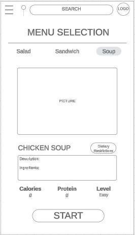

# Menu Selection Page

This is the page when users can select the recipe they would like to choose. There are suggested food categories on top. 
  When users select the recipe, they can see a picture and the name of the meal and a short description of the recipe and all the ingredients.
  Dietary Restrictions button allows users quickly input their health restrictions and confirm that the recipe is safe to use.
  There are key information such as calories, protien and difficulty level so that users can make their decisions to continue or not.
  When users hit Start button, they can customize their serving sizes, ingredients, and more.
